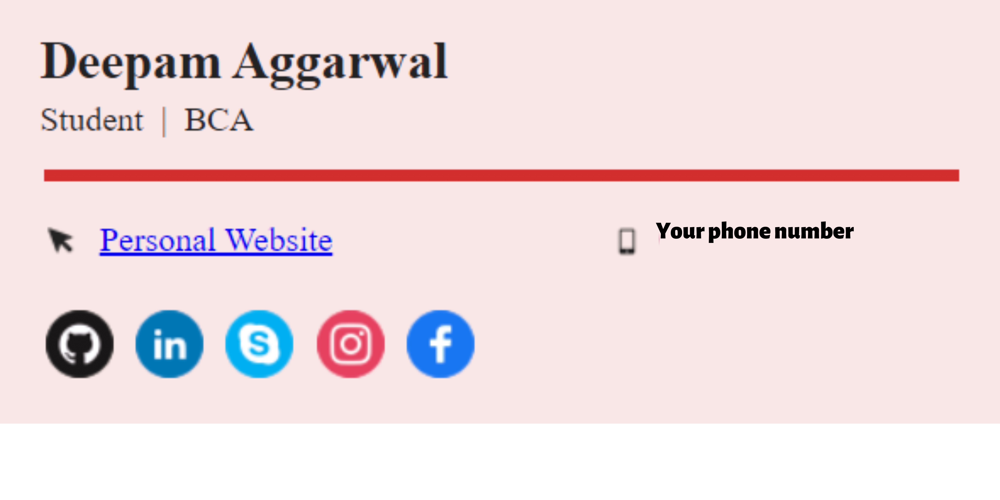
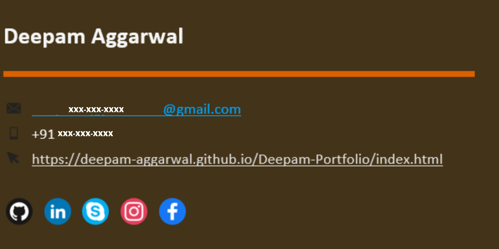

Signature

 

## Table of contents

- [Overview](#overview)
  - [Screenshot](#screenshot)
- [My process](#my-process)
  - [Built with](#built-with)
  - [Continued development](#continued-development)
- [Author](#author)

## Overview

### Screenshot

    

## My process

### Built with

- Semantic HTML5 markup

### Continued development
More customization coming soon...

## Author

- Website - [Deepam Aggarwal](https://deepam-aggarwal.github.io/Deepam-Portfolio/index.html)

## Other repositories (to contribute) and stats:

